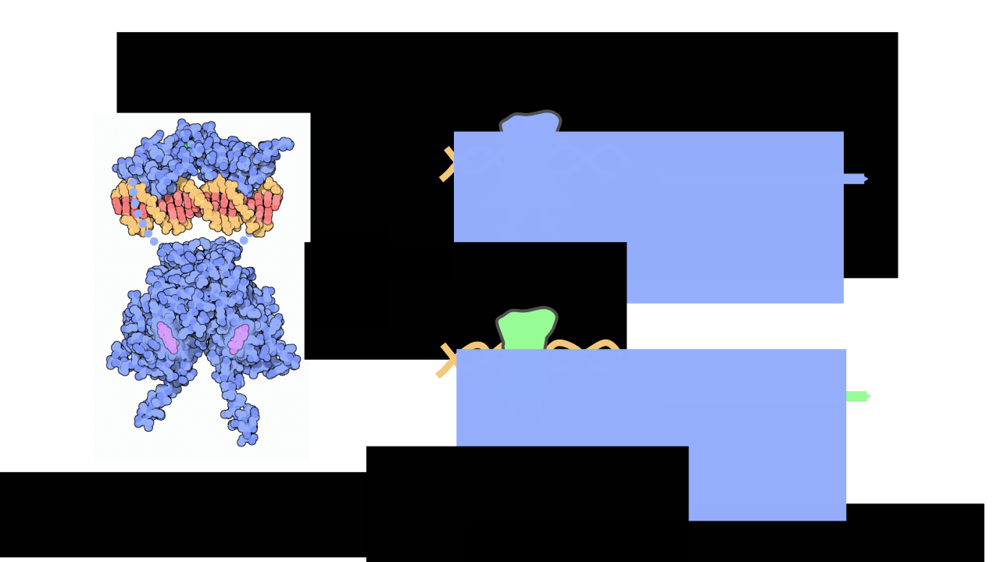

# Resurrecting ancient proteins in Python

Zach Sailer

>>>>>>>>>>>>>>>>>>>>>>>>>>>>>>>>>>>>>>>>>>>>>>

## Harms Lab introduction

>>>>>>>>>>>>>>>>>>>>>>>>>>>>>>>>>>>>>>>>>>>>>>


>>>>>>>>>>>>>>>>>>>>>>>>>>>>>>>>>>>>>>>>>>>>>>



>>>>>>>>>>>>>>>>>>>>>>>>>>>>>>>>>>>>>>>>>>>>>>

## Introduce Phylogenetics

>>>>>>>>>>>>>>>>>>>>>>>>>>>>>>>>>>>>>>>>>>>>>>

## Introduce Ancestral sequence reconstruction

>>>>>>>>>>>>>>>>>>>>>>>>>>>>>>>>>>>>>>>>>>>>>>

## How ASR is done in real life.

- Manually (or custom script) BLAST to get sequences
- Align using MSAProbs or alignment software
- Manually edit alignment where software breaks down
- Construct a tree using RaxML, PhyML, etc.
- Resurrect ancestral node sequences.
- Visualize FigTree


- All software is unaware of other software
- Multiple sequence and tree formats.

>>>>>>>>>>>>>>>>>>>>>>>>>>>>>>>>>>>>>>>>>>>>>>

## Modern software

- Bioconda
- DendroPy
- BioPython
- Visualize

>>>>>>>>>>>>>>>>>>>>>>>>>>>>>>>>>>>>>>>>>>>>>>

## Proposed software

Familiar, Interactive Frontend

- Phylogenetics -- reproducible tool
- Phylopandas (Single format)
- Jupyter Notebooks (Lab) as reproducible frontend
- Fasta and Tree Viewer as interactive viz

>>>>>>>>>>>>>>>>>>>>>>>>>>>>>>>>>>>>>>>>>>>>>>

##

>>>>>>>>>>>>>>>>>>>>>>>>>>>>>>>>>>>>>>>>>>>>>>


```python

from phylopandas as ph

df = ph.read_fasta("sequences.fasta")

```

>>>>>>>>>>>>>>>>>>>>>>>>>>>>>>>>>>>>>>>>>>>>>>
